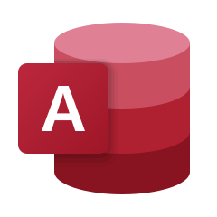
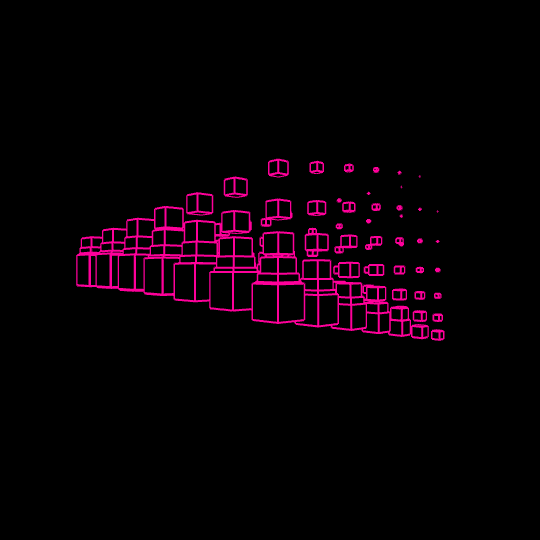
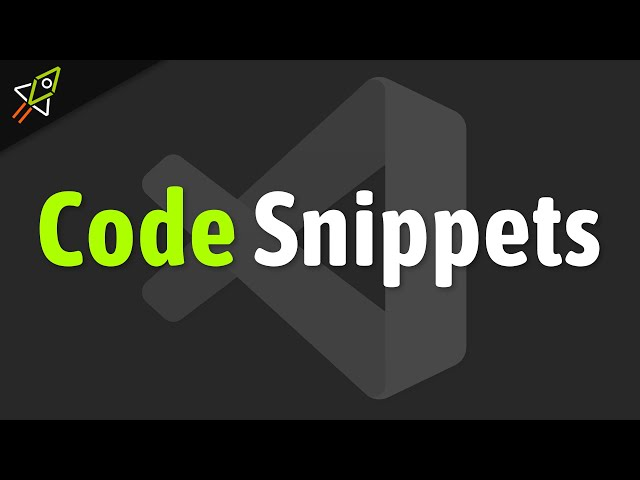
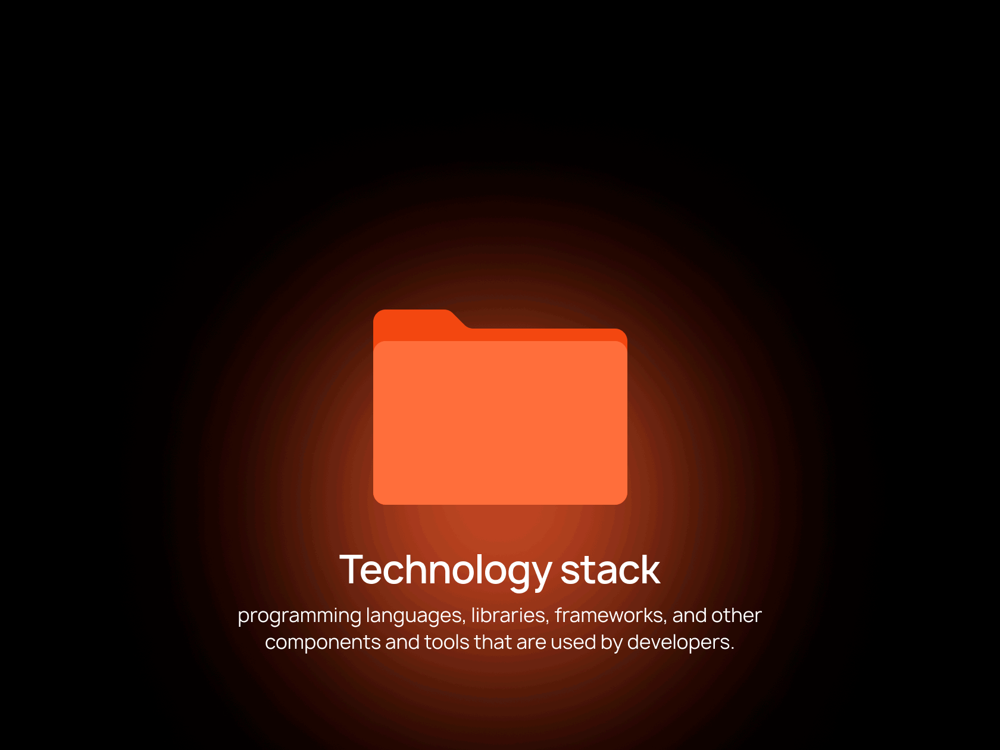

<h2>&nbsp;Hi I'm Rajeev</h2>

<!-- <h2>&nbsp;Hi I'm Rajeev</h2> -->

Data enthusiast exploring real-world solutions through Excel automation & BI tools.

<!-- Header Section -->
<!--  -->
<!-- -->

<!--  -->

 <!-- 
 -->
   
  <!--  -->
 <!--   -->

<!-- 
 -->

<!--  -->
<!--  -->
<!--  -->
<!--  -->
<!--  -->
<!--  -->
<!--  -->

<!-- LinkedIn profile badge -->
<!-- purple
 -->

<!-- blue
 -->

<!-- light blue
 -->

<!-- charcoal black
 -->  

<!-- violet
 -->

<!--  -->
<!-- 🔗 [Connect with me on LinkedIn](https://in.linkedin.com/in/rajeev-tiwari123) -->

<!-- Typing Animation -->

  
<!--  -->

<!--  -->

<!-- 👤 About Me -->
<!--  -->

<!-- <h2>👨‍💼 About Me</h2> -->

I’m passionate about turning raw data into meaningful business insights.
With strong expertise in Microsoft 365 and growing proficiency in modern data tools like
Power BI, SQL, and Python, I focus on optimizing reports, automating workflows,
and driving smarter business decisions. I’m committed to continuous learning
and delivering data-driven solutions that create real business impact.

<!--  -->

<!-- 🚀 My Mission  -->

<!--  -->
<!-- <h2>&nbsp;🎯 My Mission</h2> -->

- To simplify complex data for easy interpretation.
- To fulfill my dream of becoming a proficient Data Analyst.
- To create professional and automated reporting systems.
- To continuously learn and apply new data technologies.
- To contribute to data-driven decision making in organizations.

<!--  -->

<!-- ## 💻 Skills & Expertise -->
<!-- <h2>&nbsp;Skills & Expertise</h2> -->

<!--  -->
<!--  -->

<!-- -->
<!--  -->
<!-- -->
<!--  -->
<!--  -->
<!-- -->
<!-- -->
<!--  -->
<!--  -->
<!--  -->
<!--  -->
<!--  -->
<!--  -->
<!--  -->
<!--  -->

<!-- ⚙️ Tech Stack -->
<!-- <h2>Tech Stack</h2> -->
<h2>Tech Stack</h2>

<!--  -->

 
  
  
  
  
  
  
  
  
  
   
   
  
  
  
  
  
  
  
  
  
  
  
  
  
  
  
  
  
  <!--  -->
  <!--  -->
  <!--  --> 
  <!--  -->
  <!--  -->
  <!--  -->
  <!--  -->
  <!--  -->
  <!--  -->
  <!--  -->
  <!--  -->
  <!--  -->
  <!--  -->
  <!--  -->
  <!--  -->
  <!--  -->
  <!--   --> 

<!--  -->

<!-- ## 💫 Things I Love -->
<!-- &nbsp;***Things I Love*** -->

  
  
  
  
   
  
  
  
  <!--  -->
  <!--  -->
  <!--  -->
  <!--  -->
  <!--  -->
  <!--  -->

<!--  -->

<!-- ## 📂 Featured Projects -->

<!-- Showcasing my practical experience across data and technology tools — from cleaning and transforming data to creating insightful visualizations.
Each project reflects my ability to turn raw information into meaningful, business-ready insights.
-->

<!-- - 📊 [**Hospital Emergency Room Dashboard**](https://github.com/rajeevgit8055hub/Hospital-Emergency-Room-Dashboard) -->

<!-- - 🧩 [**Unified Multi Extension Folder Based Data Cleaning**](https://github.com/rajeevgit8055hub/Unified-Multi-Extension-Folder-Based-Data-Cleaning) -->

<!-- - 🗃️ [**SmartBite Online Food Delivery DBMS**](https://github.com/rajeevgit8055hub/SmartBite-Online-Food-Delivery-DBMS) -->

<!-- - 🖼️ [**PowerPoint / Business Insights Decks**](https://github.com/rajeevgit8055hub/Business-Insights-Decks) -->

<!-- - 🛢 [**NETFLIX Data SQL Analysis**](https://github.com/rajeevgit8055hub/NETFLIX-Data-SQL-Analysis) -->

<!-- - 💖 [**LoveForever – A Heartfelt Digital Promise**](https://github.com/rajeevgit8055hub/LoveForever-A-Heartfelt-Digital-Promise) -->

 
<!-- - 📈 [**Nescafe Driving Coffee Sales Excellence**](https://github.com/rajeevgit8055hub/Nescafe-Driving-Coffee-Sales-Excellence) -->

<!-- - 📉 [**HSBC Strategic Stakeholder Intelligence**](https://github.com/rajeevgit8055hub/HSBC-Strategic-Stakeholder-Intelligence) -->

<!-- - 🌐 [**Dynamic Neon Glow Website**](https://github.com/rajeevgit8055hub/rajeevtiwari.github.io) -->

<!-- - 🎓 [**Verified Digital Credentials**](https://github.com/rajeevgit8055hub/Verified-Digital-Credentials) -->

<!-- - 💻 [**Dynamic Developer Hub**](https://github.com/rajeevgit8055hub) -->

<!--  -->

<!--  -->

<!-- ## 💡 ##Tip: -->
🌟 Each project embodies my commitment to transforming data and ideas into impactful outcomes — from dynamic data models and interactive dashboards to professional business presentations and insightful reports. These works reflect both technical precision and a deep understanding of business storytelling.

<!--  -->

<!-- ## 🧠 Code Snippets  -->

  

A curated collection of concise, practical code examples — spanning Excel formulas, SQL queries, VBA scripts, Power BI logic, and mini HTML-CSS analytical experiments.

Each snippet reflects my daily learning, logical thinking, and problem-solving approach.

<!-- ## 📬 Connect with Me -->

<!--  -->
<!--  -->
<!--  -->

<!--  -->
<!-- 
 -->

<!--  -->

<!-- ## 🚀 GitHub Performance Overview -->

<!-- &nbsp;***Github Stats*** -->
<!--  -->

<!--## 🏆 GitHub Trophies -->
&nbsp;***GitHub Trophies***

<!-- 💎 GitHub Trophy -->
<!--  -->
<!--  -->
<!-- 

  

 -->

<!-- 🪪 Profile Summary Card -->
&nbsp;***Profile Summary Card***
<!-- &nbsp;***Profile Summary Card*** -->

<!-- 📊 GitHub Stats (Main) -->
&nbsp;***Github Stats***

<!-- 💬 Top Languages -->
<!-- &nbsp;***Top Languages*** -->
&nbsp;***Top Languages***

<!-- 🔝 Top Contributed Repositories-->
&nbsp;***Top Contributed Repositories***
<!--  -->

<!--## 🔥 GitHub Streak -->
&nbsp;***GitHub Streak***

<!--## 🔥 GitHub Streak -->
<!--  -->
<!--  -->
<!--  -->
<!--  -->
<!--  -->
<!-- [https://github-readme-streak-stats.herokuapp.com/?user=rajeevgit8055hub&theme=dark](https://github-readme-streak-stats-username.vercel.app/<YOUR_GITHUB_USERNAME>?theme=dark) -->
<!--  -->

<!--## 📈 Activity Graph -->
&nbsp;***Activity Graph***

  

<!-- 

  

 -->

<!--  -->

<!-- 🐍 Snake Contribution Animation -->
&nbsp;***Snake Contribution Animation***
<!--  -->

<!-- Typing Animation / 🤝 Thanks for Visiting! -->
<!--  -->

<!-- 🧠 Contribution Pulse -->
&nbsp;***Contribution Pulse***

<!-- https://media.giphy.com/media/v1.Y2lkPTc5MGI3NjExbDB4a3Z2b3Z1N3Y3NjVjYXpzdmw3NG9rMDRrbGdqYWdpODI3bGtzNyZlcD12MV9pbnRlcm5hbF9naWZfYnlfaWQmY3Q9cw/26tn33aiTi1jkl6H6/giphy.gif -->
<!-- 🧠 Contribution Pulse -->

<!-- 🧠 Extra Contribution Pulse -->
<!--  -->
<!--  -->
<!--  -->
<!--  -->
<!--  -->
<!--  -->
<!--  -->

<!-- Typing Animation / 🤝 Thanks for Visiting! -->

<!-- Buy me a coffee -->

<!-- Dynamic Repositories Badge (Enable Later) -->
<!--  -->
<!--my_image  -->

<!--  -->
<!--  -->
<!--  -->      

<!-- the end my github -->

<!-- ## 🚀 GitHub Performance Overview -->

<!-- Total Contributions, Join Date, Repo Count (Summary small)

-->

<!-- Commit Distribution Chart (Hourly/Weekly Pattern)

-->

<!-- Language per Repo (Pie Style)

-->

<!-- Language per Commit (Pie Style) 

-->

<!-- Gif Starts -->
<!-- &nbsp;***colors cubes*** -->

<!-- &nbsp;***Snake Contribution Animation*** -->

<!-- &nbsp;***computer screen*** -->

<!-- &nbsp;***computer screen*** -->

<!-- &nbsp;***boy running*** -->

<!-- &nbsp;***cat on laptop*** -->

<!-- &nbsp;***cat on laptop*** -->

<!-- &nbsp;***GitHub Stats*** -->

<!-- &nbsp;***cat working on computer*** -->

<!-- &nbsp;***color computer*** -->

<!-- Gif end -->

<!-- BASIC STATS -->
<!--  -->
<!--  -->
<!--  -->
<!--  -->
<!--  -->
<!--  -->

<!-- Neon Github Stats -->
<!--  -->

<!-- Neon Top Languages -->
<!--  -->

<!-- Purple Trophy -->
<!--  -->

<!-- Neon Activity Graph -->
<!-- 
 -->

<!-- Mediumslateblue Streak -->
<!--  -->

<!--  -->
<!--  -->
<!--  -->
<!--  -->
<!--  -->
<!--  -->
<!--  -->
<!--  -->

