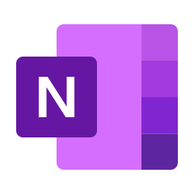

# Hi, i'm_rajeev
Data enthusiast exploring real-world solutions through Excel automation & BI tools.

<!-- Header Section --> 

<!-- Typing Animation -->

<!--  -->

<!--  -->

<!-- 👤 About Me -->
## 👤 About Me

 

I’m passionate about turning raw data into meaningful business insights.
With strong expertise in Microsoft 365 and growing proficiency in modern data tools like
Power BI, SQL, and Python, I focus on optimizing reports, automating workflows,
and driving smarter business decisions. I’m committed to continuous learning
and delivering data-driven solutions that create real business impact.

<!--  -->

<!-- 🚀 My Mission  -->
## 🚀 My Mission 

- To simplify complex data for easy interpretation.
- To fulfill my dream of becoming a proficient Data Analyst.
- To create professional and automated reporting systems.
- To continuously learn and apply new data technologies.
- To contribute to data-driven decision making in organizations.

<!--  -->

<!-- 💻 My Skills -->
## 💻 My Skills

<!--  -->

<!-- -->
<!--  -->
<!-- -->
<!--  -->
<!--  -->
<!-- -->
<!-- -->
<!--  -->
<!--  -->
<!--  -->
<!--  -->
<!--  -->
<!--  -->
<!--  -->
<!--  -->

<!-- ⚙️ Tools -->
## ⚙️ Tools

 
  
  
  
  
  
  
  
  
  
   
   
  
  
  
  
  
  
  
  
  
  
  
  
  
  
  
  
  
  <!--  -->
  <!--  -->
  <!--  --> 
  <!--  -->
  <!--  -->
  <!--  -->
  <!--  -->
  <!--  -->
  <!--  -->
  <!--  -->
  <!--  -->
  <!--  -->
  <!--  -->
  <!--  -->
  <!--  -->
  <!--  -->
  <!--   --> 

<!--  -->

<!-- ## 💫 Things I Love -->
## 💫 Things I Love

  
  
  
  
   
  
  
  
  <!--  -->
  <!--  -->
  <!--  -->
  <!--  -->
  <!--  -->
  <!--  -->

<!--  -->
   
<!-- ## 📬 Connect with Me -->
## 📬 Connect with Me

<!--  -->

<!-- 
 -->

<!--  -->

<!-- ## 📊 GitHub Stats -->
&nbsp;***Github Stats***
<!--  -->

<!--## 📊 GitHub Streak -->
<!--  -->
<!-- -->

<!-- 

 
 [https://github-readme-streak-stats.herokuapp.com/?user=rajeevgit8055hub&theme=dark](https://github-readme-streak-stats-username.vercel.app/<YOUR_GITHUB_USERNAME>?theme=dark
) -->

<!--## 📊 Activity Graph -->
&nbsp;***Activity Graph*** 

  

<!-- 

  

 -->

<!--  -->

<!-- Typing Animation / 🤝 Thanks for Visiting! -->

<!-- Dynamic Repositories Badge (Enable Later) -->
<!--  -->
<!--my_image  -->

<!--  -->

<a class="badge-base__link LI-simple-link" href="https://in.linkedin.com/in/rajeev-tiwari123?trk=profile-badge">Rajeev Tiwari</a>

<a class="badge-base__link LI-simple-link" href="https://in.linkedin.com/in/rajeev-tiwari123?trk=profile-badge">Rajeev Tiwari</a>

<a class="badge-base__link LI-simple-link" href="https://in.linkedin.com/in/rajeev-tiwari123?trk=profile-badge">Rajeev Tiwari</a>

<a class="badge-base__link LI-simple-link" href="https://in.linkedin.com/in/rajeev-tiwari123?trk=profile-badge">Rajeev Tiwari</a>

   
---------------------------------------------------------------------------------------------------------------------------------------------------------------------

<!-- LinkedIn Official Advance Badge Code (Centered Only) -->

  

    <a class="badge-base__link LI-simple-link"
       href="https://in.linkedin.com/in/rajeev-tiwari123?trk=profile-badge">
       Rajeev Tiwari
    </a>
  

 

------------------------------------------------------------------------------------------------------------------------  

🔗 [Connect with me on LinkedIn](https://in.linkedin.com/in/rajeev-tiwari123)

----------------------------------------------------------------------------------

<!-- LinkedIn Official Advance Badge Code -->

<!-- Right aligned container -->

  

    <a class="badge-base__link LI-simple-link"
       href="https://in.linkedin.com/in/rajeev-tiwari123?trk=profile-badge">
       Rajeev Tiwari
    </a>
  

------------------------------------------------------------------------------------------

<!-- LinkedIn Official Advance Badge Code with Right Alignment -->

<!-- 🔹 Parent Section -->
<section style="display: flex; justify-content: space-between; align-items: center; flex-wrap: wrap; padding: 40px; background: linear-gradient(135deg, #0A66C2, #004182); border-radius: 20px; box-shadow: 0 4px 15px rgba(0,0,0,0.2); color: white; font-family: Arial, sans-serif;">

  <!-- 🔸 Left Side Content -->
  

    <h2 style="font-size: 28px; margin-bottom: 10px;">Let's Connect on LinkedIn 🤝</h2>
    

      I’m always open to professional networking, learning, and collaboration opportunities.
      Connect with me on LinkedIn to stay updated and grow together!
    

  

  <!-- 🔸 Right Side LinkedIn Badge -->
  

    

      <a class="badge-base__link LI-simple-link"
         href="https://in.linkedin.com/in/rajeev-tiwari123?trk=profile-badge">
         Rajeev Tiwari
      </a>
    

  

</section>

----------------------------------------------------------------------

<!-- 🟦 Step 1: LinkedIn की Official Script 
     यह script LinkedIn के badge को लोड करने का काम करती है।
     इसे आप अपनी HTML page में सिर्फ एक बार ही जोड़ें -->

<!-- 🟦 Step 2: आपका LinkedIn Badge Container 
     नीचे दिया गया div आपके LinkedIn प्रोफाइल कार्ड (badge) को दिखाएगा। 
     data-theme="dark" का मतलब है dark mode, 
     और data-size="medium" से badge का आकार तय होता है। -->

     data-size="medium"           <!-- बैज का साइज (small, medium, large, extra-large में से कोई भी) -->
     data-theme="dark"            <!-- थीम (light या dark) -->
     data-type="VERTICAL"         <!-- लेआउट प्रकार (VERTICAL या HORIZONTAL) -->
     data-vanity="rajeev-tiwari123"  <!-- आपका LinkedIn vanity URL username -->
     data-version="v1">           <!-- LinkedIn badge का version -->
     
  <!-- नीचे का लिंक असल में आपके प्रोफाइल तक पहुँचने का मार्ग है -->
  <a class="badge-base__link LI-simple-link"
     href="https://in.linkedin.com/in/rajeev-tiwari123?trk=profile-badge">
     Rajeev Tiwari
  </a>

------------------------------------------------------------------------------------------

<!-- LinkedIn Script -->

<!-- Transparent Container with Particle Background -->
<section style="position: relative; padding: 50px; text-align: center;">
  
  <!-- Particle effect background (optional div) -->
  

  
  <!-- Transparent LinkedIn Badge Section -->
  

    <h2 style="color: white; margin-bottom: 15px;">Connect with Me on LinkedIn</h2>

    

      <a class="badge-base__link LI-simple-link"
         href="https://in.linkedin.com/in/rajeev-tiwari123?trk=profile-badge">
         Rajeev Tiwari
      </a>
    

  

</section>

----------------------------------------------------------------------------------

<!-- Step 1: LinkedIn Script -->

<!-- Step 2: Stylish LinkedIn Badge Section -->
<section style="display:flex; justify-content:center; align-items:center; flex-direction:column; background:linear-gradient(135deg, #0A66C2, #004182); padding:40px 20px; border-radius:20px; box-shadow:0 4px 20px rgba(0,0,0,0.2); color:white; font-family:Arial, sans-serif; text-align:center;">
  
  <h2 style="margin-bottom:10px; font-size:28px; font-weight:600;">Connect with Me on LinkedIn</h2>
  

    I'm active on LinkedIn — let's connect professionally and grow together 🤝
  

  <!-- LinkedIn Profile Badge -->
  

    <a class="badge-base__link LI-simple-link"
       href="https://in.linkedin.com/in/rajeev-tiwari123?trk=profile-badge">
       Rajeev Tiwari
    </a>
  

</section>

                     
